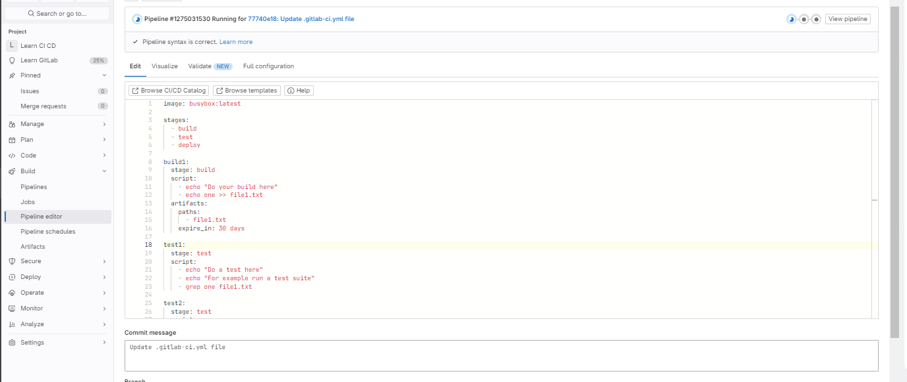

# Урок 1. Основы CI/CD. Знакомство с gitlab

1. Зарегистрироваться на gitlab.com
   
2. Создать pipeline и runner
   
   
3. Попробовать сохранить артефакт одной из стадий + исключить из папки с артифактами любой файл
   
   
   
   
4. Попробовать сделать любую gitlab pages
   
   
   
   
